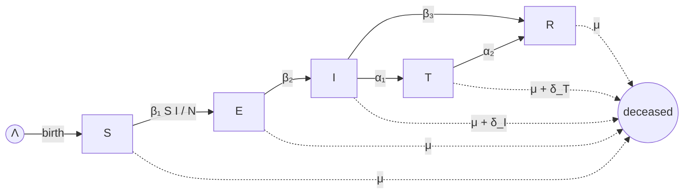

<div align="center">

<picture>
  <source media="(prefers-color-scheme: dark)" srcset="assets/hero_d_dark.png">
  
</picture>

# SEITRNet

### Network-based SEITR epidemic modeling in R

*A reproducible framework for simulating the spread of infectious disease over heterogeneous contact networks, with a coupled mean-field ODE benchmark and built-in network observables.*

[](https://www.r-project.org/)
[]()
[]()
[]()
[](https://doi.org/10.1140/epjp/s13360-025-06481-z)

[Overview](#overview) ·
[Model](#mathematical-model) ·
[Install](#installation) ·
[Quick start](#quick-start) ·
[API](#api-reference) ·
[Outputs](#outputs) ·
[Cite](#citation)

</div>

---

## Overview

`SEITRNet` implements a five-compartment **S**usceptible–**E**xposed–**I**nfected–**T**reated–**R**ecovered (SEITR) epidemic process on top of an explicit contact network. It is designed for studies in which *who is connected to whom* materially affects transmission dynamics — a setting in which the classical well-mixed ODE model is known to misestimate peaks, timing, and final epidemic size.

The package provides:

- A stochastic, discrete-time SEITR process simulated on a user-specified random graph,
- A coupled deterministic ODE solver for the mean-field analogue,
- Five canonical random-graph generators (Erdős–Rényi, Barabási–Albert, Watts–Strogatz, regular lattice, random regular),
- Demographic turnover (births, natural and disease-attributable deaths) with a hybrid integer-plus-Bernoulli rounding scheme,
- A panel of standard network observables (degree distribution, global clustering, mean path length, largest connected component) computed at every time step,
- Replication and aggregation utilities for multi-experiment comparisons.

The intended audience is researchers in mathematical epidemiology, network science, and computational biology who need a transparent, scriptable baseline for network-mediated SEITR dynamics.

---

## Mathematical Model

### Compartmental flow



### Mean-field ODE system

Let $S(t), E(t), I(t), T(t), R(t)$ denote compartment sizes and $N(t) = S+E+I+T+R$. The deterministic SEITR system is

$$
\begin{aligned}
\frac{dS}{dt} &= \Lambda - \frac{\beta_1 S I}{N} - \mu S, \\
\frac{dE}{dt} &= \frac{\beta_1 S I}{N} - (\beta_2 + \mu)\,E, \\
\frac{dI}{dt} &= \beta_2 E - (\beta_3 + \alpha_1 + \delta_I + \mu)\,I, \\
\frac{dT}{dt} &= \alpha_1 I - (\alpha_2 + \delta_T + \mu)\,T, \\
\frac{dR}{dt} &= \beta_3 I + \alpha_2 T - \mu R, \\
\frac{dN}{dt} &= \Lambda - \mu N - \delta_I I - \delta_T T.
\end{aligned}
$$

The ODE is solved with `deSolve::ode` and serves as the well-mixed reference against which network simulations are benchmarked.

### Basic reproduction number

The disease-free equilibrium is $(S^{\*}, E^{\*}, I^{\*}, T^{\*}, R^{\*}) = (\Lambda \/ \mu, 0, 0, 0, 0)$. Applying the next-generation matrix construction to the $(E, I, T)$ subsystem yields a closed-form expression for $\mathcal{R}_0$ in terms of the model parameters; the package returns this quantity together with the simulation output for convenience in parameter sweeps.

### Network process

At each integer time step $t \to t+1$:

1. **Demographic events.** Expected counts of disease deaths ($\delta_I |I_t|$), treatment deaths ($\delta_T |T_t|$), natural deaths ($\mu |V_t|$), and births ($\Lambda$) are decomposed as `floor + Bernoulli(fractional_part)`. Selected nodes are deleted; new nodes are appended in compartment $S$ and connected according to the topology's attachment rule.
2. **Status transitions.** Each surviving node draws an independent uniform $u \sim U(0,1)$ and updates its state according to the per-step probabilities induced by the rate parameters above (e.g., $S \to E$ with probability $\beta_1 I_t / N_t$, $E \to I$ with probability $\beta_2$, etc.).
3. **Bookkeeping.** Compartment counts and graph observables are recorded.

Independent replicates (`num_exp`) are aggregated into per-time-step means and dispersion bands.

---

## Installation

### Prerequisites

```r
install.packages(c("igraph", "deSolve", "ggplot2", "dplyr", "tidyr"))
```

R $\geq$ 4.2 is recommended.

### From GitHub

```r
install.packages("devtools")
devtools::install_github("skaraoglu/SEITRNet")
library(SEITRNet)
```

---

## Quick Start

```r
library(SEITRNet)
set.seed(2026)

# Three replicates on a Watts–Strogatz small-world network
result <- SEITR_network(
  network_type = "WS",
  n            = 200,
  n_par1       = 0.10,   # rewiring probability
  n_par2       = 20,     # lattice neighborhood size
  t            = 150,
  num_exp      = 3,
  verbose      = FALSE
)
```

The returned object contains compartment trajectories (network and ODE), per-step network observables, and metadata for each replicate.

---

## API Reference

### `SEITR_network()`

Top-level entry point. Generates a random graph of the requested topology, initializes compartment labels, and runs `num_exp` replicate stochastic simulations alongside the matched ODE.

```r
SEITR_network(
  network_type = "ER",
  n = 100, n_par1 = 0.9, n_par2 = 10,
  Lambda = 1.1,
  beta1 = 0.8, beta2 = 0.18, beta3 = 0.02,
  alpha1 = 0.1, alpha2 = 0.055,
  delta_I = 0.03, delta_T = 0.03, mu = 0.01,
  S = 85, E = 5, I = 10, Tt = 0, R = 0, N = 100,
  t = 100, num_exp = 10,
  verbose = FALSE,
  state = NULL, parameters = NULL
)
```

#### Network topologies

| Code | Topology              | Generator (`igraph`)        | `n_par1`                       | `n_par2`            |
|------|-----------------------|------------------------------|--------------------------------|---------------------|
| ER   | Erdős–Rényi           | `sample_gnp`                 | edge probability $p$           | —                   |
| BA   | Barabási–Albert       | `sample_pa`                  | scaling factor: $m = n \cdot n_\text{par1}$ | —     |
| WS   | Watts–Strogatz        | `sample_smallworld`          | rewiring probability $p$       | neighborhood $k$    |
| LN   | Regular lattice       | `make_lattice`               | neighborhood $k$               | —                   |
| RR   | Random regular        | `sample_k_regular`           | degree $k$                     | —                   |

#### Epidemiological parameters

| Argument  | Symbol     | Default | Description                                      |
|-----------|------------|---------|--------------------------------------------------|
| `Lambda`  | $\Lambda$  | 1.1     | Birth rate (inflow into $S$)                    |
| `beta1`   | $\beta_1$  | 0.80    | Transmission rate, $S \to E$                    |
| `beta2`   | $\beta_2$  | 0.18    | Progression rate, $E \to I$                     |
| `beta3`   | $\beta_3$  | 0.02    | Spontaneous recovery rate, $I \to R$            |
| `alpha1`  | $\alpha_1$ | 0.10    | Treatment uptake rate, $I \to T$                |
| `alpha2`  | $\alpha_2$ | 0.055   | Recovery rate from treatment, $T \to R$         |
| `delta_I` | $\delta_I$ | 0.03    | Disease-induced mortality (from $I$)            |
| `delta_T` | $\delta_T$ | 0.03    | Treatment-associated mortality (from $T$)       |
| `mu`      | $\mu$      | 0.01    | Natural mortality (acts on all compartments)    |

#### Initial conditions and simulation controls

| Argument           | Default     | Description                                 |
|--------------------|-------------|---------------------------------------------|
| `n`, `N`           | 100         | Initial population size                     |
| `S, E, I, Tt, R`   | 85, 5, 10, 0, 0 | Initial compartment sizes               |
| `t`                | 100         | Simulation horizon (time steps)             |
| `num_exp`          | 10          | Number of stochastic replicates             |
| `verbose`          | `FALSE`     | Per-event logging                           |
| `state`, `parameters` | `NULL`   | Optional pre-built `deSolve` inputs         |

> **Note.** Initial compartment sizes must satisfy $S + E + I + T + R = n$. The package validates this on entry and raises an informative error on mismatch.

### `compare_experiment_sets()`

```r
compare_experiment_sets(list(ws_p.1_k20, er_p.2, ba_m.75))
```

Aligns trajectories from multiple `SEITR_network()` calls onto a common time axis and produces faceted comparison plots. *Currently inactive — scheduled for the next release.*

---

## Examples

### Single topology

```r
ba_m.75 <- SEITR_network("BA", n_par1 = 0.75, num_exp = 5)
```

### Topology sweep

```r
ws_p.1_k20 <- SEITR_network("WS", n_par1 = 0.10, n_par2 = 20, num_exp = 3)
er_p.2     <- SEITR_network("ER", n_par1 = 0.20,              num_exp = 3)
ba_m.75    <- SEITR_network("BA", n_par1 = 0.75,              num_exp = 3)

compare_experiment_sets(list(ws_p.1_k20, er_p.2, ba_m.75))
```

---

## Outputs

Each call to `SEITR_network()` returns a list containing:

- **Trajectories** — per-replicate, per-time-step counts for $S, E, I, T, R, N$ from both the network simulation and the matched ODE.
- **Network observables** — per-time-step degree distribution, global clustering coefficient (transitivity), mean shortest-path length, and largest-connected-component size.
- **Visualizations** — initial graph layout colored by status; periodic snapshots of the evolving network; ODE-vs-network compartment overlays with peak annotations; faceted observable panels.
- **Metadata** — replicate seeds, topology specification, parameter vector, and computed $\mathcal{R}_0$.

---

## Reproducibility

All stochastic primitives (graph generation, demographic events, status transitions) are mediated through R's RNG. To make a run bit-reproducible, set the seed before invocation:

```r
set.seed(2026)
result <- SEITR_network("WS", n_par1 = 0.1, n_par2 = 20, num_exp = 3)
```

Per-replicate seeds are returned in the output metadata so individual realizations can be regenerated in isolation.

---

## Citation

If this software contributes to a publication, please cite: Karaoglu S, Imran M, McKinney BA. Network-based SEITR epidemiological model with contact heterogeneity: comparison with homogeneous models for random, scale-free and small-world networks. The European Physical Journal Plus. 2025 Jun 18;140(6):551, https://doi.org/10.1140/epjp/s13360-025-06481-z.

---

<div align="center">

Built with <a href="https://igraph.org/r/">igraph</a> and <a href="https://desolve.r-forge.r-project.org/">deSolve</a></sub>

</div>
